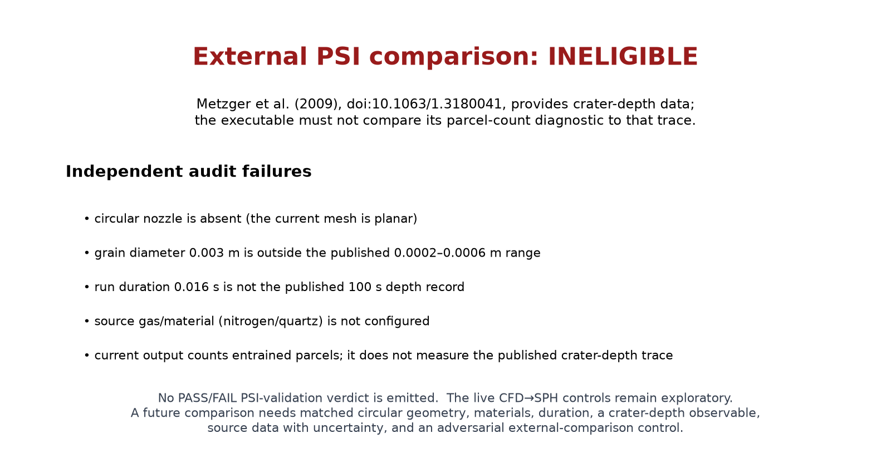

# jet_crater

This is an exploratory coupled CFD impinging-inflow and granular-SPH free-surface
case. The gas begins quiescent; a downward physical top-boundary inflow is advanced
through the CFD flux, boundary, CFL, and RK plugins. It is not written into CFD
interior cells or prescribed at the granular surface. The evolving CFD state is
sampled at SPH surface parcels and returns Schiller–Naumann drag through the GRASS
exchange-port seam.

The Bagnold/Iversen–White and Roberts material is modelling context, not a quantitative PSI validation.  The independently retrieved Metzger et al. (2009) crater-depth experiment is documented in [the external-reference audit](data/metzger_2009_reference.md); its circular nitrogen nozzle, quartz grain range, stand-off, and 100-second observation interval do **not** match this planar, 3-mm, 0.016-second executable case.  The audit fails closed rather than allowing a cross-geometry comparison to masquerade as validation.  A severed-drag-port run is a coupling fault control, not external validation.



The graph is an executable comparison-eligibility result. It visibly lists why
the available external crater-depth trace cannot be used for this case. It is
not measured-vs-reference PSI evidence and it does not emit a validation PASS.

```bash
~/projects/automation/bin/run-bench.sh examples/jet_crater
```

References: Bagnold (1941); Shields (1936); Iversen & White (1982); Roberts, IAS Paper 63-50 (1963); Schiller & Naumann (1935).

The reference provenance and the limits of this case are recorded in [data/references.md](data/references.md).

```bash
python3 examples/jet_crater/external_reference_audit.py
```

This command intentionally exits nonzero and prints `EXTERNAL PSI COMPARISON:
INELIGIBLE`.  That result is evidence that the present case may not claim the
published crater-depth trace as a pass.  It is not a benchmark failure to be
weakened or bypassed.

The benchmark wrapper likewise exits nonzero after writing the eligibility
figure. This is deliberate: the automation records a zero exit as a validation
PASS, and rendering an honest ineligibility report must never create one.

## What an eligible comparison must contain

The repository now enforces a machine-readable external-comparison contract
through [`data/validation_contract.py`](data/validation_contract.py).  Before a
future driver can compare a PSI result, it must commit a source-data manifest
with citation, circular-nozzle geometry, stand-off, gas, material, grain range,
forcing, duration, same-observable units, an absolute experimental uncertainty,
the raw/digitized data file, and a deliberately wrong coupling control.  This
does not make the present experiment eligible: no such manifest is included for
the mismatched Metzger trace.

## Authorship and validation limits

This example and its documentation were drafted with AI assistance and require domain-expert review. It demonstrates an executable SPH↔CFD seam and a fault control. It does **not** yet validate crater growth, ejecta, or erosion rate against an external PSI experiment; those claims are withheld until a traceable data series, matching boundary conditions, grid/convergence evidence, and an adversarial quantitative comparison are added.
