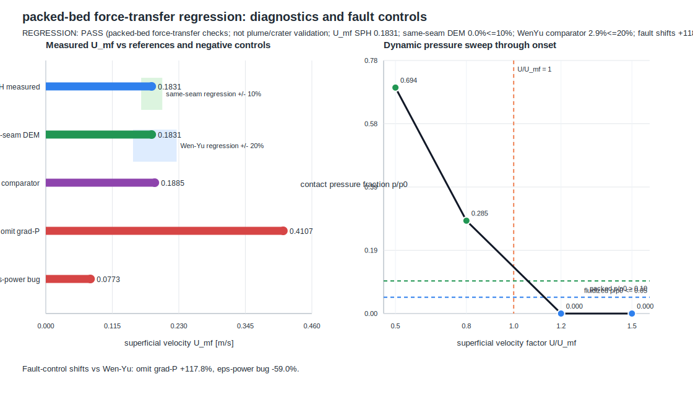

# packed_bed_seam

This example checks an SPH-to-CFD **packed-bed seam regression** at the dynamic
minimum-fluidization limit. Its gas velocity is imposed every coupling tick;
`CfdStatePlugin` and `IdealGasPlugin` are present as the data carrier, but no
`SolverPlugin` advances a CFD field. It measures the SPH-continuum `U_mf` from
the live force hand-off, compares it with Wen-Yu, runs two fault controls that
must move outside the frozen local regression limit, and sweeps the coupled bed
through onset.



The plot is generated from `sweep.py`, which runs the example and parses its own
reported `U_mf` values, frozen regression limits, fault controls, and dynamic
pressure sweep. Its `REGRESSION: PASS` means only that this local software
configuration reproduced its specified force-transfer checks. Its DEM comparison
is same-seam consistency, while Wen--Yu is a packed-bed comparator; neither is
independent PSI evidence. It is not evidence for an advancing impinging-jet
crater, erosion-rate, or ejecta prediction. The only admissible route to that
claim is the held-out, adversarial protocol in
[`EXTERNAL_VALIDATION.md`](EXTERNAL_VALIDATION.md).

```bash
python3 examples/packed_bed_seam/sweep.py
```
