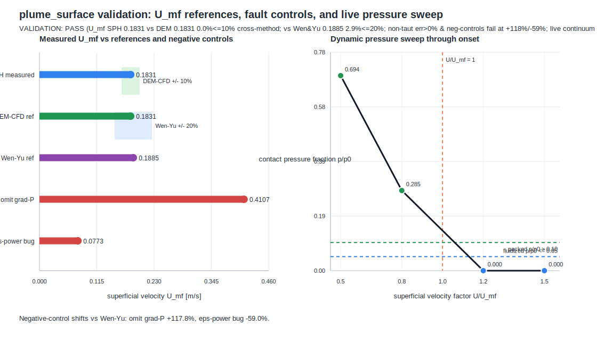

# plume_surface

This example checks the coupled SPH-CFD packed-bed seam at the dynamic
minimum-fluidization limit. It measures the SPH-continuum `U_mf` from the live
coupling, compares it with the same-seam DEM-CFD reference and the Wen-Yu
correlation, runs two negative controls that must move outside tolerance, and
sweeps the live coupled bed through onset.



The plot is generated from `sweep.py`, which runs the example and parses its own
reported `U_mf` values, tolerance checks, negative controls, and dynamic pressure
sweep. The current committed figure shows `VALIDATION: PASS` for this
minimum-fluidization regression only. It is not evidence for an impinging-jet
crater, erosion-rate, or ejecta prediction; see
[`../psi_evidence/`](../psi_evidence/) for the fail-closed external-evidence
requirements for that separate claim.

```bash
python3 examples/plume_surface/sweep.py
```
