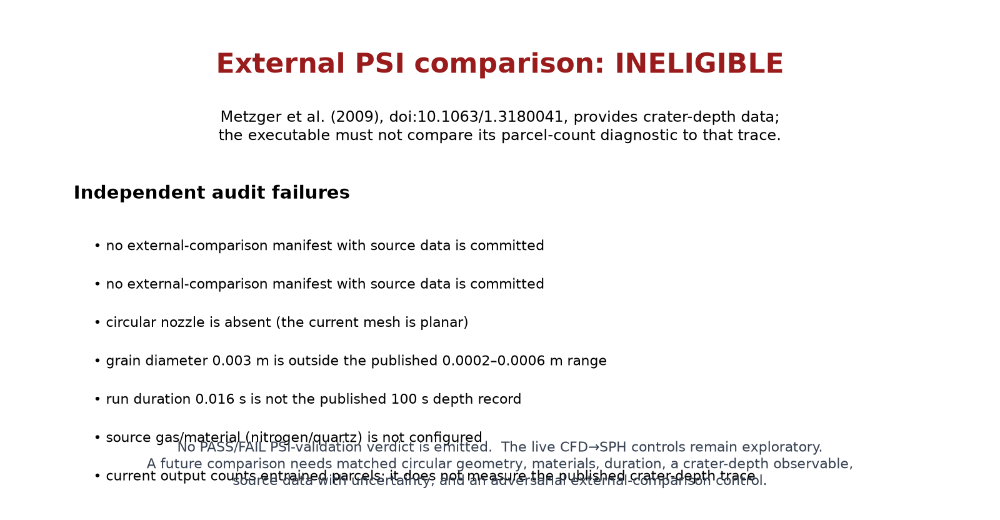

# uniform_inflow_surface_seam

This is an exploratory coupled CFD uniform-inflow and granular-SPH free-surface
seam probe. The gas begins quiescent; a spatially uniform downward top-boundary inflow is advanced
through the CFD flux, boundary, CFL, and RK plugins. It is not written into CFD
interior cells or prescribed at the granular surface. It does not represent a
nozzle, an impinging jet, a wall jet, or a crater. The evolving CFD state is
sampled at SPH surface parcels and returns Schiller–Naumann drag through the GRASS
exchange-port seam.

The independently retrieved Metzger et al. (2009) crater-depth experiment is documented in [the external-reference audit](data/metzger_2009_reference.md); its circular nitrogen nozzle, quartz grain range, stand-off, and 100-second observation interval do **not** match this planar, 3-mm, 0.016-second executable case.  The audit fails closed rather than allowing a cross-geometry comparison to masquerade as validation.  A severed-drag-port run is a seam observation, not external validation.



The graph is an executable comparison-eligibility result. It visibly lists why
the available external crater-depth trace cannot be used for this case. It is
not measured-vs-reference PSI evidence and it does not emit a validation PASS.

```bash
~/projects/automation/bin/run-bench.sh examples/uniform_inflow_surface_seam
```

The local drag closure is Schiller & Naumann (1935). The crater experiment used
only for the ineligibility audit is Metzger et al. (2009).

The reference provenance and the limits of this case are recorded in [data/references.md](data/references.md).

```bash
python3 examples/uniform_inflow_surface_seam/external_reference_audit.py
```

This command intentionally exits nonzero and prints `EXTERNAL PSI COMPARISON:
INELIGIBLE`.  That result is evidence that the present case may not claim the
published crater-depth trace as a pass.  It is not a benchmark failure to be
weakened or bypassed.

The driver runs the boundary-driven CFD→SPH seam before it evaluates the
reference firewall, then exits nonzero after writing the eligibility figure.
This keeps an ineligible source from masking a broken executable path while
ensuring that automation cannot record the run as a PSI-validation PASS.

## What an eligible comparison must contain

A future validation must use a primary observation series with source data (or
a documented digitization), configured circular-nozzle geometry, stand-off,
gas, material, grain range, forcing, duration, the same observable and units,
measurement uncertainty, convergence evidence, and a deliberately wrong
coupling control evaluated against that same held-out series. These are review
requirements, not a local manifest that can authorize a scientific claim.

## Authorship and validation limits

This example and its documentation were drafted with AI assistance and require domain-expert review. It demonstrates an executable SPH↔CFD seam and a fault control. It does **not** model an impinging jet or validate crater growth, ejecta, or erosion rate against an external PSI experiment; those claims are withheld until a traceable data series, matching nozzle boundary conditions, grid/convergence evidence, and an adversarial quantitative comparison are added.
